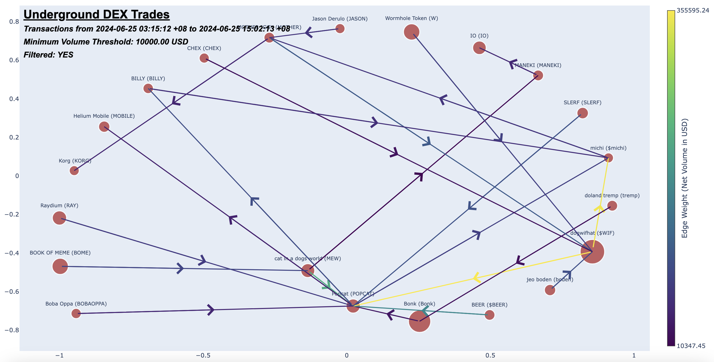
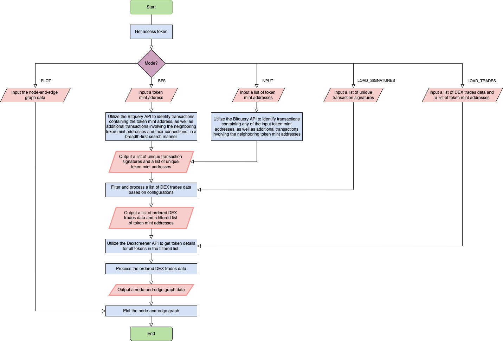
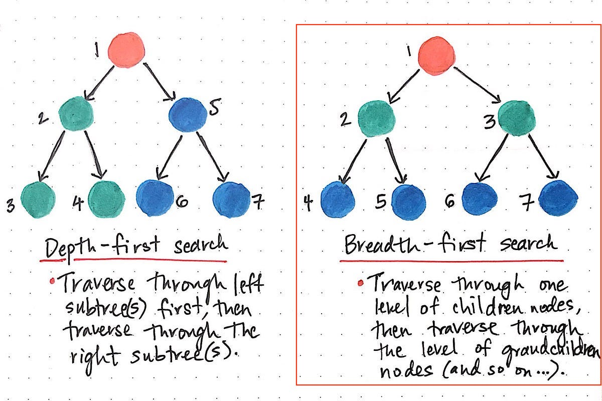
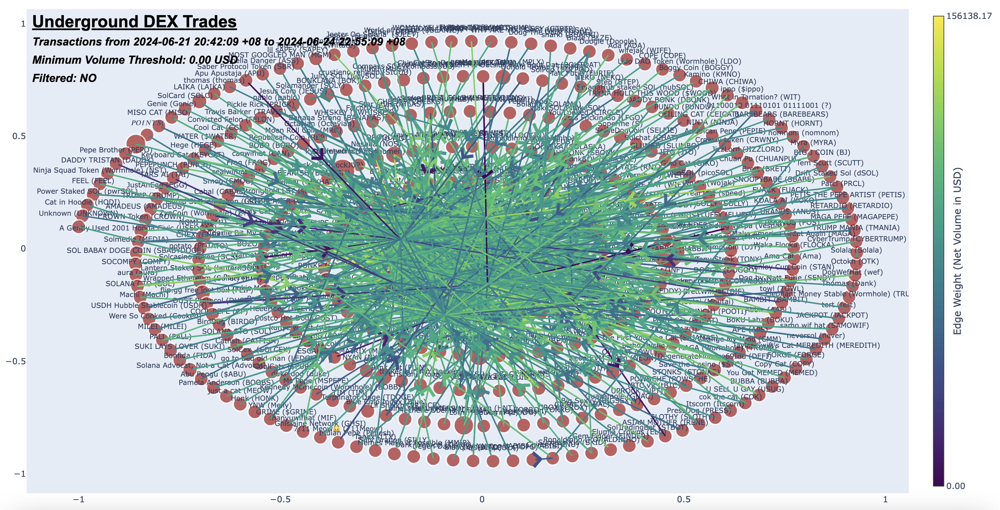
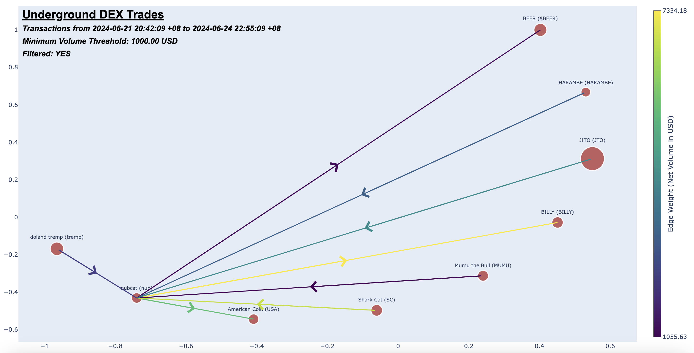

# **Underground DEX Trades**

### **Overview**
Underground DEX Trades is a program designed to visualize blockchain transactions using a node and edge graph, similar to platforms like [Bubblemaps](https://bubblemaps.io/). Nodes represent token mint addresses, and edges show the net volume flow in USD between these token mint addresses. For instance, if a user buys *dogwifhat (WIF)* using *Popcat (POPCAT)* with *100 USD*, the graph will display two nodes representing *WIF* and *POPCAT*, connected by a directional edge labeled with the transaction amount of *100 USD*, pointing from *POPCAT* to *WIF*. This allows users to understand net transaction flows between different mint addresses, aiding in trend analysis and discovery of new token addresses. This can serve to provide short-term trading insights. However, the dominance of high-market-cap coins like *Solana (SOL)*, *Jupiter (JUP)*, and *Jito (JTO)* in blockchain volumes can obscure other types of trading, such as meme coins. Underground DEX Trades aims to filter out these major tokens, focusing instead on a clearer view of alternative transaction flows and reducing noise in analysis.

<div align="center">
  
  <p><em>Underground DEX Trades Node-and-Edge Graph Example</em></p>
</div>

<br>

### Notes
- This is a **personal project** of mine and was not created under any entity.
- Please be aware that the results provided by this project might not be 100% accurate due to potential bugs.
- Please do not rely on this software to make financial decisions. **NFA**.
- **The program can only scan DEX trades data from Solana blockchain**. I may consider to add support for EVM chains, such as Ethereum and Base.
- [Bitquery Early Access Program (EAP)](https://docs.bitquery.io/docs/graphql/dataset/EAP/) is used to query Solana DEX trades data in this project. As this API version is considered new, future updates on this API may break the program. 
    - EAP is currently limited to real-time information and does not include historical data. Hence, the amount of DEX trades data retrieved from the API is limited. Due to this, any insight produced from this program is only short-term.
- Please let me know if there are any errors or ways the code may be improved.
<br>

### How It Works

<div align="center">
  
  <p><em>Underground DEX Trades Flowchart</em></p>
</div>

- The image above shows the flow of the program.
- The program starts by generating the Bitquery's access token required for the queries.
- There are various checkpoints created as the program runs, and the user can choose which checkpoint to start from based on the mode selection shown below.

#### Checkpoint 1 
- **Mode: Breadth-First Search (*BFS*)**
    - If *BFS* mode is selected, the user must provide a starting token mint address first.
    - The *BFS* algorithm starts with the root node, which is the first token mint address, and queries any DEX trade containing this address. 
    - It records new token mint addresses that trade against the root and their corresponding transaction signatures, making these new addresses the children nodes. 
    - The algorithm then queries each of these children nodes to retrieve more new token mint addresses and accumulate more transaction signatures. 
    - As the algorithm runs, all token mint addresses and the transaction signatures will be saved.
    - This process continues until the specified tree depth is reached, such as stopping at the grandchildren nodes if the depth is set to 2.
    - The program will reach *Checkpoint 1* once the *BFS* algorithm has completed.

<div align="center">
    
    <p><em>Depth-First Search vs Breadth-First Search (Source: <a href="https://medium.com/basecs/breaking-down-breadth-first-search-cebe696709d9">Breaking Down Breadth-First Search</a>)</em></p>
</div>

- **Mode: INPUT (*INPUT*)**
    - If the *INPUT* mode is selected, the user must provide a list of token mint addresses.
    - While it is up to the user to gather the token list, the repository provides two ways the user can get them.
        - ***Vybe Network API***:
            - The user can run the ```query_token_vybe_network.py``` script to retrieve a list of tokens sorted by their market cap in descending order.
        - ***Raydium API***:
            - The user can run the ```query_raydium_pools.py``` script to retrieve a list of tokens found in Raydium pools sorted by selected factor such as 24 hours volume, liquidity, and more.
    - The query will be done on this list of tokens. Unlike the *BFS* algorithm, this mode does not search more token mint addresses and transaction signatures beyond the first depth.
    - As the process runs, all token mint addresses and the transaction signatures will be saved.
    - The query process will end after all tokens in the list are queried.
    - The program will reach *Checkpoint 1* once the process has completed.

#### Checkpoint 2

- If **LOAD_SIGNATURES** mode is selected, the program will skip to this point. The user must provide a list of unique transaction signatures. Else, the program will arrive at this checkpoint after finishing *Checkpoint 1*.
- The next step of the program involves querying the recorded transaction signatures and processing them.
- The transaction signatures will be queried in batches. A single transaction signature may contain multiple pool swaps, hence multiple data may be returned after querying a single transaction signature. After ordering the swaps, the actual intent of the transaction can be deduced using the sell side token of the first swap and the buy side token of the last swap.
- Two filters will take place here:
    - ***MEV***:
        - If the sell side token of the first swap equals to the buy side token of the last swap (eg. *1 SOL* --> *1.0019 SOL*), the trade will be ignored.
        - This is to prevent self-loop in the node-and-edge graph and any form of volume bias.
    - ***Excluded tokens***:
        - If the sell side token of the first swap or the buy side token of the last swap is found in the list of excluded tokens, the trade will be ignored.
        - This part helps to prevent high-market-cap coins from dominating the volume flow.
        - Users can configure it in ```config.py```.
- The filtered trade data and the filtered token mint addresses will be saved.
- The program will reach *Checkpoint 2* once the DEX trades data are processed.

#### Checkpoint 3

- If **LOAD_TRADES** mode is selected, the program will skip to this point. The user must provide a list of DEX trades data and a list of token mint addresses. Else, the program will arrive at this checkpoint after finishing *Checkpoint 2*.
- At this point, the program will rely on Dexscreener API to retrieve token details, such as name, symbol, volume, FDV, socials, of the remaining tokens.
- The program will start to create the node-and-edge data.
    - ***Node Information***:
        - Contains all token mint addresses and their respective token details
    - ***Edge Information***:
        - Contains unique pair of token mint addresses representing swaps discovered between them and the net volume flow in a single direction
        - Eg. If the pair is named *'25hAyBQfoDhfWx9ay6rarbgvWGwDdNqcHsXS3jQ3mTDJ-2Dyzu65QA9zdX1UeE7Gx71k7fiwyUK6sZdrvJ7auq5wm'* and the net volume is *37 USD*, this means that a net *37 USD* flows from the token '25hAyBQfoDhfWx9ay6rarbgvWGwDdNqcHsXS3jQ3mTDJ' to the token *'2Dyzu65QA9zdX1UeE7Gx71k7fiwyUK6sZdrvJ7auq5wm'*. No *'2Dyzu65QA9zdX1UeE7Gx71k7fiwyUK6sZdrvJ7auq5wm-25hAyBQfoDhfWx9ay6rarbgvWGwDdNqcHsXS3jQ3mTDJ'* should be found as the pair already existed. Using the same example but in another perspective, *'2Dyzu65QA9zdX1UeE7Gx71k7fiwyUK6sZdrvJ7auq5wm-25hAyBQfoDhfWx9ay6rarbgvWGwDdNqcHsXS3jQ3mTDJ'* simply means a net *-37 USD* flow from the token *'2Dyzu65QA9zdX1UeE7Gx71k7fiwyUK6sZdrvJ7auq5wm'* to the token *'25hAyBQfoDhfWx9ay6rarbgvWGwDdNqcHsXS3jQ3mTDJ'*, which refers to the same thing as before.
- The graph data will be saved.
- The program will reach *Checkpoint 3* once the graph data is created.

#### Node-and-Edge Graph Plotting

- If **PLOT** mode is selected, the program will skip to this point. The user must provide the graph data. Else, the program will arrive at this checkpoint after finishing *Checkpoint 3*.
- The graph data will be processed and displayed in a node-and-edge graph.

<div align="center">
    
    <p><em>Unfiltered Node-and-Edge Graph</em></p>
</div>

- However, the graph can be very messy if no further filtering is done.
- Filtering done in this phase includes:
    - ***Minimum Volume Threshold***
        - User can set a minimum volume threshold to filter higher volume flow edges. This can help to remove noisy data on the graph.
    - ***Filter Token Names or Symbols***
        - User can select specificially which tokens to display on the graph. All token pairs that contains the indicated tokens will be displayed.

<div align="center">
    
    <p><em>Filtered Node-and-Edge Graph</em></p>
</div>

- The node-and-edge graph uses the [spiral layout](https://networkx.org/documentation/stable/reference/generated/networkx.drawing.layout.spiral_layout.html). The reason for this option is to minimize edge crossings. User can still refer to the link [here](https://networkx.org/documentation/stable/reference/drawing.html) for a selection of graph layout.
<br>

### **APIs**
1. [Bitquery](https://docs.bitquery.io/docs/intro/)
    - Used to query on-chain DEX trades data
    - ***REQUIRED*** and ***API keys REQUIRED***
2. [Dexscreener](https://docs.dexscreener.com/api/reference)
    - Used to query token-related information such as name, symbol, and fully diluted valuation (FDV)
    - ***REQUIRED*** and ***API keys NOT REQUIRED***
3. [Raydium](https://api-v3.raydium.io/docs/)
    - Used to query a list of tokens based on criteria such as 24hrs volume and liquidity, which can be used starting as mint addresses for the program
    - ***OPTIONAL*** and ***API keys NOT REQUIRED***
4. [Vybe Network](https://docs.vybenetwork.com/docs/overview)
    - Used to query token-related information such as volume and holder count
    - ***OPTIONAL*** and ***API keys REQUIRED***
5. [Birdeye](https://birdeye.so/find-gems?chain=solana)
    - Used to query a list of tokens based on criteria such as 24 hrs volume and 24 hrs trades, which can be used as starting mint addresses for the program
    - ***OPTIONAL*** and ***API keys REQUIRED***
    - ***NOT WORKING ANYMORE*** due to Cloudflare
<br>

### **Installation**
1. Clone the repository using
    ```
    git clone https://github.com/gordonjun2/underground-dex-trades.git
    ```
2. Navigate to the root directory of the repository.
    ```
    cd underground-dex-trades
    ```
3. Install required packages.
    ```
    pip install -r requirements.txt
    ```
4. Rename private keys file.
    ```
    mv private_template.ini private.ini
    ```
5. Sign up for *Bitquery API* [here](https://bitquery.io/) and get the respective keys in the link below.
    - BITQUERY_CLIENT_ID: https://account.bitquery.io/user/api_v2/applications
    - BITQUERY_CLIENT_SECRET: https://account.bitquery.io/user/api_v2/applications
    - BITQUERY_V1_API_KEY: https://account.bitquery.io/user/api_v1/api_keys
6. Sign up for *Vybe Network API* [here](https://www.vybenetwork.com/) and get the respective keys in the link below.
    - VYBE_NETWORK_X_API_KEY: https://alpha.vybenetwork.com/dashboard/api-management
7. Copy and save the keys into the private keys file.
<br>

### **Configuration**
- ```BITQUERY_CLIENT_ID```: Bitquery Client ID from ```private.ini``` file
- ```BITQUERY_CLIENT_SECRET```: Bitquery Client Secret from ```private.ini``` file
- ```BITQUERY_V1_API_KEY```: Bitquery V1 API Key from ```private.ini``` file
- ```VYBE_NETWORK_X_API_KEY```: Vybe Network X API Key from ```private.ini``` file
- ```BIRDEYE_AGENT_ID```: Birdeye Web Agent ID from ```private.ini``` file (NOT IN USE ALREADY)
- ```BIRDEYE_USER_AGENT```: Birdeye Web User Agent from ```private.ini``` file (NOT IN USE ALREADY)
- ```BITQUERY_API_VERSION```: Bitquery API Version
    - Available options: 'EAP', 'v1', 'v2' (DEX Trades data only available in 'EAP')
- ```BITQUERY_API_VERSION_URL_MAP```: A dictionary that maps the Bitquery API versions to their respective URL
- ```EXCLUDED_MINT_ADDRESSES```: A list of excluded token mint addresses
    - These are the tokens that are excluded during the DEX trades filtering process.
- ```variables```: A dictionary of variables to be used in Bitquery's GraphQL query statement (Not required at the moment).
- ```VYBE_NETWORK_QUERY_LIMIT```: The number of tokens to retrieve from the Vybe Network Token API. Max is 1000.
- ```MAX_RETRIES```: The maximum number of POST request retries before quitting.
- ```RETRY_AFTER```: The wait time after unsuccessful POST request before calling again.
- ```MAX_NO_OF_SIGNATURES_PER_BATCH```: The maximum number of signatures to query at once.
    - To prevent total retrieved data from going above the Bitquery's maximum data limit at 25,000, this value should be set a buffer under 25,000. 
- ```EDGE_POINTS_QUANTITY```: This number represents how many number of markers are placed within an edge. When the mouse pointer hovers on the marker, the edge information is displayed.
- ```EDGE_POINTS_OPACITY```: This number represents the opacity value of the markers on each edge. The default is 0.
<br>

### **Main Program Usage**
- Main Program Arguments
    ```
    -m      : BFS: use Breadth First Search to traverse and query the tree of the provided 
              mint address up to the specified depth and retrieve transaction signatures and DEX trades data, 
              INPUT: provide a list of mint addresses to query and retrieve transaction signatures and DEX trades data,
              LOAD_SIGNATURES: load the transaction signatures from a saved JSON file and retrieve DEX trades data,
              LOAD_TRADES: skip the query process and load the DEX trades data from a saved JSON file, and
              PLOT: skip the query process and load the graph data from a saved JSON file.

    -a      : The first mint address to query. REQURED for BFS mode.

    -d      : The depth to which the function should traverse. Default is 2. REQURED for BFS mode.

    -f      : The file to load the JSON that contains the list of mint addresses, the list of unique signatures, the DEX trades data, or the graph data. REQURED for INPUT, LOAD_SIGNATURES, LOAD_TRADES, PLOT mode.

    -af     : The file to load the JSON that contains the list of remaining mint addresses. REQURED for LOAD_TRADES mode.

    -s      : The number of days before the current local time to query the DEX trades data. Default is 2.

    -v      : The minimum volume threshold in USD for the DEX trades data to be displayed for graph plot. Default is 0.

    -pfn    : Filter token name and its related token name to be displayed for graph plot. Use comma separator. Use EITHER plot_filter_names or plot_filter_symbols but not both. Eg. 'dogwifhat,nubcat'.

    -pfs    : Filter token symbol and its related token symbol to be displayed for graph plot. Use comma separator. Use EITHER plot_filter_names or plot_filter_symbols but not both. Eg. 'WIF,NUB'.
    ```
- Run the command below to start the main program:
    ```
    python main.py -m <set options and arguments here>

    Eg. 
    python main.py -m *BFS* -a GtDZKAqvMZMnti46ZewMiXCa4oXF4bZxwQPoKzXPFxZn -d 2 -s 2 -v 10000 -pfs 'wif,nub,popcat'
    or
    python main.py -m plot -f ./saved_data/graph_data_20240624_225313.json
    ```
<br>

### **Other APIs Usage**
- ***Vybe Network API***
    - Run the command below to retrieve a list of tokens ordered by their market cap in descending order:
        ```
        python query_token_vybe_network.py
        ```
- ***Raydium API***
    - Arguments
        ```
        -pt     : Pool Type. Available values : all, concentrated, standard.

        -psf    : Pool Field. Available values : default, liquidity, volume24h, fee24h, apr24h, volume7d, fee7d, apr7d, volume30d, fee30d, apr30d.

        -st     : Sort Type. Available values : desc, asc.

        -ps     : Page Size. Max 1000.

        -p     : Page Index.
        ```
    - Run the command below to retrieve a list of tokens based on criteria such as 24hrs volume and liquidity:
        ```
        python query_raydium_pools.py -pt all -psf volume24h -st desc -p 1
        ```
- ***Birdeye (NOT WORKING ANYMORE)***
    - Run the command below to retrieve a list of tokens ordered by their 24 hours volume in descending order:
        ```
        python query_birdeye.py
        ```
<br>
